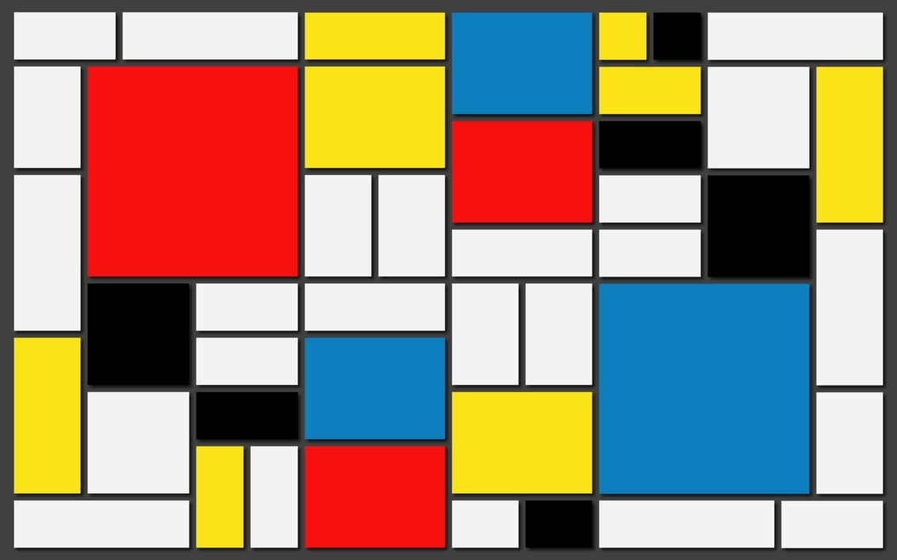

# CSS Layout Challenge ⭐ 😈

Ready to get serious about css layout? 

Inside a file called abstract.html, recreate the Mondrian-inspired image included in this repo. You can use any colors you like, but the layout should be the same.

You can use flexbox, grid, or any other CSS techniques you find effective.

It will be effective to pick a section of the image and work on just that. Then pick another section and do that one. Then you can think about how can you combine those sections into a single page.

You'll need some way of targeting the boxes, so you will need to make use of `id` and `class` attributes.

_[Piet Mondrian](https://en.wikipedia.org/wiki/Piet_Mondrian) was a 20th century Dutch painter whose abstract paintings often featured geometric lines and planes._
